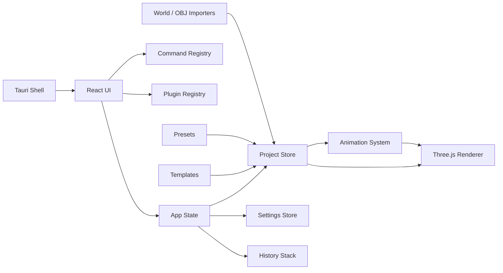

# Architecture

MineMotion Studio is split into domain modules so later phases can add real
world import, richer rigs, render/export tools, and external plugins without
rewriting the editor.

## Runtime Shape

## Modules

- `src/ui`: editor panels, modals, command palette, settings, plugin manager,
  and help UI.
- `src/renderer`: Three.js viewport, camera controls, sky, grid, materials, and
  scene rendering.
- `src/minecraft`: block palette, terrain presets, world folder detection, NBT
  skeleton, and Anvil region header helpers.
- `src/animation`: keyframes, tracks, linear interpolation, and project
  sampling.
- `src/rigs`: Minecraft character rig definitions and default Steve-style rig.
- `src/assets`: OBJ import and asset registry.
- `src/project`: project schema, serializer, migration, initial state, and
  object helpers.
- `src/settings`: app settings schema, defaults, serializer, and persistence.
- `src/templates`: starter project templates.
- `src/presets`: camera, rig pose, animation, block palette, and sky presets.
- `src/commands`: command model, registry, built-in commands, and command
  palette.
- `src/history`: undo/redo snapshot stack.
- `src/plugins`: plugin manifest, permissions, API shape, registry, loader, and
  built-in plugin metadata.
- `src-tauri`: Tauri v2 desktop shell scaffold.

## Data Flow

1. React owns the authoritative `MineMotionProject` state.
2. User actions call scoped handlers in `App.tsx`.
3. Project mutations pass through history-aware helpers.
4. Settings mutations are serialized to local storage.
5. Timeline playback samples the project with `Animator.sampleProject`.
6. `Viewport` passes the sampled project and viewport settings to
   `SceneRenderer`.
7. `SceneRenderer` rebuilds the visible Three.js scene root from the project.

This is intentionally straightforward for early development. Later phases can
replace full scene rebuilds with incremental scene graph updates once larger
world chunks and assets arrive.

## Renderer

The renderer uses:

- `WebGLRenderer` with shadows enabled.
- `OrbitControls` for viewport navigation.
- Generated block materials.
- `InstancedMesh` per block type for terrain.
- Raycasting against the scene root for selection.
- `BoxHelper` selection outline.
- `SkySystem` for background, fog, ambient light, and directional light.

No proprietary Minecraft textures are bundled. `MinecraftMaterialSystem` is the
future insertion point for resource-pack textures.

## Project System

The project format is schema-versioned JSON. Phase 1.5 supports
`schemaVersion: 2` and migrates Phase 1 schema v1 files.

Saved data includes:

- project settings
- scene objects
- object visibility, lock state, and metadata
- sky preset
- world scan summary
- characters
- cameras
- imported OBJ assets
- animation timeline

## Settings System

App settings are separate from project files and stored locally. Project
settings are embedded in `.mmsproj` files. This keeps user preferences separate
from portable project data while still allowing each project to define FPS,
duration, terrain, and render defaults.

## Commands

Commands are registered as small descriptors with an ID, title, group, optional
shortcut, and run function. The command palette queries the registry and invokes
commands by ID. This gives future plugins and UI panels a common action system.

## Plugins

The plugin system is a skeleton in Phase 1.5. It validates manifests, tracks
enabled state, registers built-in plugin metadata, and defines the future API
shape. External plugin scripts are not executed yet.

## Animation

Animation tracks target object IDs and properties:

- `transform.position`
- `transform.rotation`
- `transform.scale`

Sampling uses linear interpolation between vector keyframes. The system is ready
to add bone tracks later, for example `bone.head.rotation`.

## Importers

World import is currently read-only and conservative. It scans a selected world
folder for expected Minecraft files and records a summary. Full Anvil/NBT
parsing is planned for Phase 2.

OBJ import reads `.obj` text into project assets and displays it through
Three.js `OBJLoader` with a neutral material.
