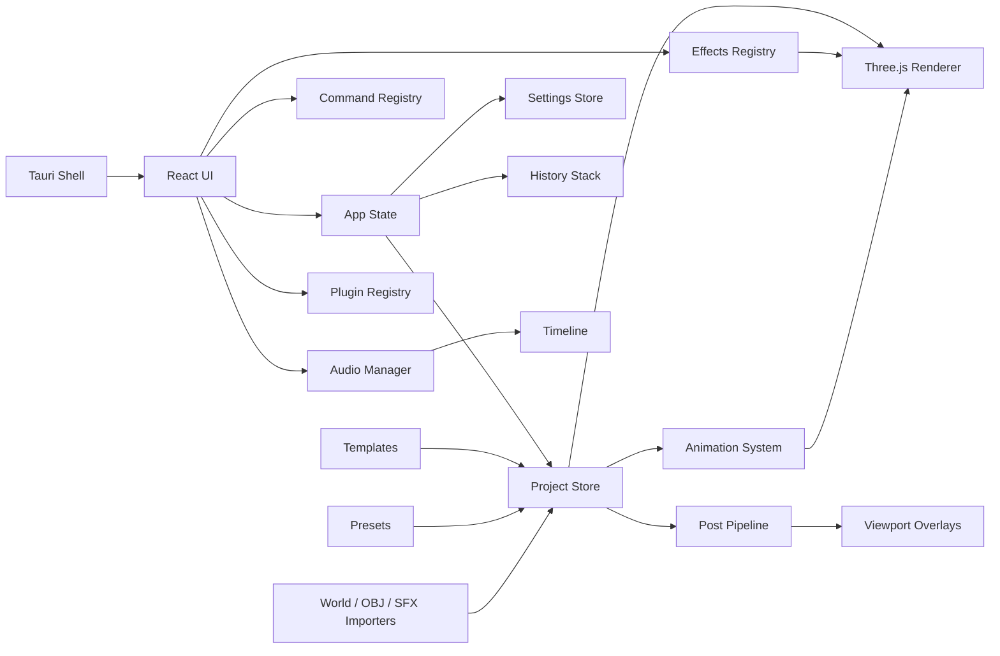

# Architecture

MineMotion Studio is split into domain modules so cinematic tooling, real
Minecraft import, rendering/export, and future plugins can grow without a full
rewrite.

## Runtime Shape

## Modules

- `src/ui`: editor panels, modals, command palette, effects panel, settings,
  plugin manager, and help UI.
- `src/renderer`: Three.js viewport, camera controls, sky, grid, materials,
  terrain, scene rendering, and world-space effect preview.
- `src/rendering/postprocessing`: post-processing settings, presets, and
  overlay style pipeline.
- `src/effects`: effect definitions, instances, registry, serializer, spawner,
  and timeline helpers.
- `src/audio`: audio clip types, import helpers, placeholder SFX registry,
  playback manager, serializer, and timeline helpers.
- `src/minecraft`: block palette, terrain presets, world folder detection, NBT
  skeleton, and Anvil region helpers.
- `src/animation`: transform keyframes, timeline sampling, and interpolation.
- `src/project`: schema v3, serializer, migrations, timeline sync, initial
  state, and object helpers.
- `src/plugins`: manifest, permissions, API shape, registry, loader, and
  built-in plugin metadata.
- `src-tauri`: Tauri v2 desktop shell scaffold.

## Project System

Project files use schema v3. The serializer migrates v1 and v2 projects by
adding:

- active camera
- render settings
- post-processing settings
- effect instances
- audio clips
- typed timeline lanes
- camera focal length/active flags

## Rendering

The renderer still uses a simple full scene rebuild strategy. Phase 2 adds
world-space VFX into the scene root:

- lightning bolt lines
- shockwave rings
- glow burst cube particles

Screen-space effects and post-processing are handled by React overlays around
the canvas. This keeps Phase 2 buildable without a heavy dependency or risky
shader stack.

## Timeline

The original transform tracks remain unchanged. Phase 2 adds `timelineTracks`
for typed lanes:

- transform
- effect
- audio
- postProcessing

Effect/audio lanes are synchronized from `effects.instances` and `audio.clips`.

## Audio

Imported browser audio files are stored as project clip metadata with data URLs.
Built-in SFX are placeholder descriptors and simple tone hooks, not bundled
copyrighted audio.

## Plugin Boundary

Plugin extension points now include effects, post-processing presets, SFX,
render presets, and timeline item types. External plugin JavaScript execution is
still disabled.
