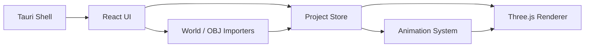

# Architecture

MineMotion Studio is split into domain modules so Phase 2 and later work can add
real importers, richer rigs, and render/export features without rewriting the
editor.

## Runtime Shape

## Modules

- `src/ui`: editor panels and controls.
- `src/renderer`: Three.js viewport, camera controls, sky, grid, materials, and
  scene rendering.
- `src/minecraft`: block palette, demo chunk mesh, world folder detection, NBT
  skeleton, and Anvil region header helpers.
- `src/animation`: keyframes, tracks, linear interpolation, and project sampling.
- `src/rigs`: Minecraft character rig definitions and default Steve-style rig.
- `src/assets`: OBJ import and asset registry.
- `src/project`: project schema, serializer, initial state, and object lookup.
- `src-tauri`: Tauri v2 desktop shell scaffold.

## Data Flow

1. React owns the authoritative `MineMotionProject` state.
2. User actions mutate the project through small project helpers.
3. Timeline playback samples the project with `Animator.sampleProject`.
4. `Viewport` passes the sampled project to `SceneRenderer`.
5. `SceneRenderer` rebuilds the visible Three.js scene root from the project.

This is intentionally simple for Phase 1. Later phases can replace full scene
rebuilds with incremental scene graph updates once world chunks and larger
assets arrive.

## Renderer

The renderer uses:

- `WebGLRenderer` with shadows enabled.
- `OrbitControls` for viewport navigation.
- `InstancedMesh` per block type for the demo terrain.
- Raycasting against the scene root for object selection.
- `BoxHelper` selection outline.
- `SkySystem` to control background, fog, ambient light, and directional light.

No proprietary Minecraft textures are bundled. `MinecraftMaterialSystem` uses
generated colors and is the future insertion point for resource-pack textures.

## Project System

The project format is schema-versioned JSON. Phase 1 supports `schemaVersion: 1`.
The serializer rejects missing required sections and has a migration hook for
future versions.

Saved data includes:

- scene objects
- sky preset
- world scan summary
- characters
- cameras
- imported OBJ assets
- animation timeline
- metadata

## Animation

Animation tracks target object IDs and properties:

- `transform.position`
- `transform.rotation`
- `transform.scale`

Sampling uses linear interpolation between vector keyframes. The system is
generic enough to add bone tracks later, for example
`bone.head.rotation`.

## Importers

World import in Phase 1 is intentionally read-only and conservative. It scans a
selected world folder for expected Minecraft files and records a summary.
Full Anvil/NBT parsing is planned for Phase 2.

OBJ import reads `.obj` text into project assets and displays it through
Three.js `OBJLoader` with a neutral material.

