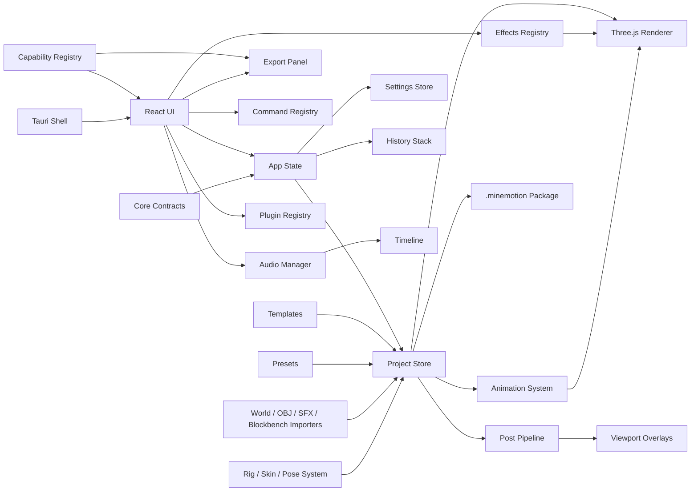

# Architecture

MineMotion Studio is split into domain modules so cinematic tooling, real
Minecraft import, rendering/export, and future plugins can grow without a full
rewrite.

## Runtime Shape

## Modules

- `src/core`: stable IDs, deterministic hash/random helpers, frame time, scene
  contracts, schema/version helpers, typed errors, runtime capabilities, and
  lightweight service boundaries.
- `src/ui`: editor panels, modals, command palette, effects panel, settings,
  plugin manager, and help UI.
- `src/renderer`: Three.js viewport, camera controls, sky, grid, materials,
  terrain, scene rendering, and world-space effect preview.
- `src/rendering/postprocessing`: post-processing settings, presets, and
  overlay style pipeline.
- `src/rendering/export`: render state snapshot/restore and viewport frame
  export helpers.
- `src/export`: export settings, validation, PNG/ZIP/WebM/WAV outputs, FFmpeg
  command planning, and the persistent production render queue.
- `src/export/ffmpeg`: native detection, settings, restricted Tauri sessions,
  and codec command construction.
- `src/export/renderQueue`: jobs, transitions, serialization, runner, UI, and
  production format dispatch.
- `src/effects`: effect definitions, instances, registry, serializer, spawner,
  and timeline helpers.
- `src/vfx/core`: typed VFX definitions, pure instances, parameter schemas,
  validation, registry, and the Phase 14 evaluation-context re-export.
- `src/vfx/compat`: pure schema 9 effect-definition/instance projection and
  guarded reverse conversion. It does not own project state or a timeline lane.
- `src/vfx/runtime`: stateless validated VFX frame evaluation. Outputs are
  finite plain data for future primitives, never renderer/GPU resources.
- `src/vfx/primitives`: versioned renderer-neutral descriptors, validation,
  bounded/nested sampling, and pure particle/beam/trail/ring/light evaluation.
- `src/audio`: audio clip types, import helpers, placeholder SFX registry,
  playback manager, serializer, and timeline helpers.
- `src/audio/export`: browser WAV mixdown and WAV encoding.
- `src/assets/library`: package asset records and asset library serialization.
- `src/minecraft`: block palette, terrain presets, world folder detection, NBT
  skeleton, and Anvil region helpers.
- `src/rigs`: Minecraft rig definitions, Steve/Alex presets, skin import/UV
  mapping, pose and animation presets, IK placeholders, and Blockbench import.
- `src/animation`: transform keyframes, timeline sampling, and interpolation.
- `src/project`: schema v9, serializer, migrations, package helpers, timeline
  sync, initial state, and object helpers.
- `src/performance`: FPS sampling, resource tracking, and disposal helpers.
- `src/plugins`: manifest, permissions, API shape, registry, loader, and
  built-in plugin metadata.
- `src-tauri`: Tauri v2 desktop shell and restricted FFmpeg staging commands.

## Project System

Project files use schema v9. The serializer migrates v1 through v8
projects by
adding:

- active camera
- render settings
- post-processing settings
- effect instances
- audio clips
- typed timeline lanes
- camera focal length/active flags
- package metadata
- asset library data
- export settings
- performance settings
- imported world chunk metadata
- rig presets, skin metadata, bone animation tracks, and Blockbench metadata
- render queue history and FFmpeg settings

## Rendering

The renderer still uses a simple full scene rebuild strategy. Current
world-space effects are created in the scene root:

- lightning bolt lines
- shockwave rings
- glow burst cube particles

Screen-space effects and post-processing are handled by React overlays around
the canvas. Export captures those overlays through a canvas capture path for
PNG output and records the live viewport canvas for WebM where browser support
allows it. Final-camera offline capture samples explicit frames, while large
PNG sequences still remain memory-bound in browser mode.

## Timeline

Transform animation tracks remain compatible with the professional animation
editor. `timelineTracks` provide typed lanes for:

- transform
- rig
- camera
- effect
- audio
- postProcessing
- sky

Effect/audio lanes are synchronized from `effects.instances` and `audio.clips`.

## Stable Boundaries

`src/core/scene` now owns generic vector, transform, and scene-entity contracts.
`ProjectFile.ts` re-exports them so current modules remain source compatible.
The project schema version is centralized in `src/core/serialization`, and
existing WebM, audio, and Tauri support helpers delegate to the central
capability registry.

Service interfaces identify scene, timeline, render, VFX, audio, asset,
project, export, and plugin boundaries. They document future extraction from
`App.tsx`; they are deliberately not a new runtime container.

VFX frame evaluation is counter-addressed rather than stateful. A versioned
typed seed composition produces root and local-frame seeds; sample indices can
be requested in any order. The evaluator does not read a registry, clock,
renderer, timeline, or project singleton, so backward seeks and offline frame
orders need no reset step.

Primitive evaluation consumes only an active validated frame plus one plain
descriptor. Per-kind caps apply before loops. Particles use stable sample
prefixes; beam, trail, and ring add nested canonical sample IDs as quality rises.
Outputs retain cloned placement metadata but never allocate Three.js, Canvas,
CSS, DOM, texture, material, cache, or runtime-class objects.

## Audio

Imported browser audio files are stored as project clip metadata with data URLs.
Built-in SFX are placeholder descriptors and simple tone hooks, not bundled
copyrighted audio.

## Plugin Boundary

Plugin extension points now include effects, post-processing presets, SFX,
render presets, and timeline item types. External plugin JavaScript execution is
still disabled.
